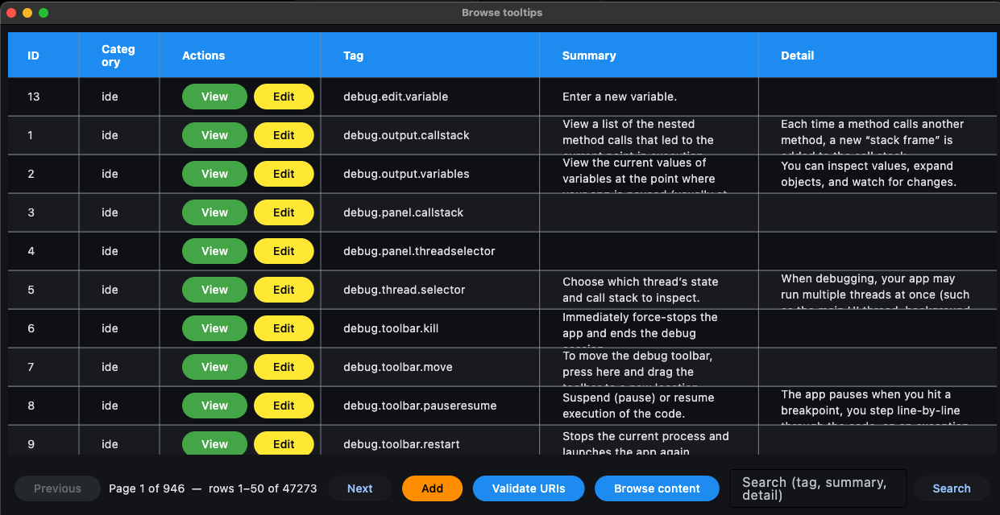

# docdb-studio

A desktop UI for browsing and editing the IDE tooltip and content database. Built on [Flet](https://flet.dev) (Flutter for Python) and SQLite; runs as a native desktop window on macOS and Windows.



## What you can do

- **Browse and search tooltips** with paginated results and per-row View / Edit.
- **Add tooltips** one at a time, in bulk via CSV, or **import an entire folder of static content** (brotli compression and >1 MiB fragmentation handled automatically).
- **Validate tooltip-button URIs** against the `Content` table — find broken links and jump straight to the offending tooltip's edit page.
- **Browse content as a Finder-style column view** with file sizes, byte totals per folder, and tooltip back-references on each HTML file.
- **Live URI validation** in the edit/add forms (✓ / ✗ icon) plus a searchable "Browse…" picker for valid paths.

## Requirements

- **Python 3.10 or newer**
- **[uv](https://docs.astral.sh/uv/)** for dependency and environment management (works natively on Windows, macOS, and Linux)

## Installing uv

### macOS

```bash
brew install uv
```

or:

```bash
curl -LsSf https://astral.sh/uv/install.sh | sh
```

### Linux

```bash
curl -LsSf https://astral.sh/uv/install.sh | sh
```

### Windows

Pick one of:

```powershell
winget install --id=astral-sh.uv -e
```

```powershell
scoop install uv
```

```powershell
powershell -ExecutionPolicy ByPass -c "irm https://astral.sh/uv/install.ps1 | iex"
```

Restart your terminal afterwards, then verify:

```bash
uv --version
```

## Setting up the project

```bash
git clone https://github.com/appdevforall/OfflineDocumentationTools.git
cd OfflineDocumentationTools
cd docdb-studio
uv sync
```

Step by step:

1. `git clone <repo-url>` downloads a copy of the project to your computer.
2. After the download finishes, you need to move your terminal into that newly-created folder.
3. `cd docdb-studio` moves you down one level to this tool.
4. `uv sync` reads the project's list of required pieces and installs them all for you.

These same commands work on macOS, Linux, and Windows (in PowerShell, Command Prompt, or Git Bash).

`uv sync` creates a virtual environment in `.venv/` and installs every dependency from `uv.lock`. There is no need to activate the venv — `uv run` does that for you.

## Installing the `brotli` command-line tool

One dependency `uv sync` cannot install for you. Databases built since ADFA-5153 compress their `Content` rows against a shared dictionary stored inside the database itself, and no Python library exposes a custom dictionary, so docdb-studio runs the `brotli` **command-line program** to read and write those rows. If it is missing, content rows come up blank and docdb-studio prints an explanatory error in the terminal you launched it from — so a blank preview plus that message means "install this tool", not "this page is empty". A database with no `CompressionDictionary` table needs nothing extra.

> **The `brotli` in `uv sync` is not this.** The Python package named `brotli` is already installed for you, and it is a *different thing* from the `brotli` program. Installing the Python package again will not help; you need the program, which puts a `brotli` (or `brotli.exe`) command on your `PATH`.

### macOS

```bash
brew install brotli
```

### Linux

```bash
sudo apt install brotli        # Debian, Ubuntu, Mint
sudo dnf install brotli        # Fedora, RHEL
```

### Windows

Pick whichever package manager you already have. Each line searches first, because the package's exact name can change; copy the name from the search results into the install command.

```powershell
winget search brotli
winget install --id=<Id from the search> -e
```

```powershell
scoop search brotli
scoop install brotli
```

```powershell
choco search brotli
choco install brotli
```

`choco` needs an Administrator terminal; `winget` and `scoop` do not.

If you already use **Git for Windows** or **MSYS2**, its package manager has it too — from the MSYS2 terminal:

```bash
pacman -S mingw-w64-ucrt-x86_64-brotli
```

**Then close your terminal and open a new one.** Windows only picks up a changed `PATH` in newly-opened terminals, so a fresh window is what makes the next check meaningful:

```powershell
brotli --version
```

A version number means you are done. If instead you get "not recognized", the program is installed somewhere that is not on your `PATH`. Find it and add that folder:

```powershell
where.exe brotli
```

If `where.exe` finds nothing, look in the install location your package manager reports (Scoop uses `%USERPROFILE%\scoop\shims`, Chocolatey uses `C:\ProgramData\chocolatey\bin`), then add that folder to `PATH` under **Settings → System → About → Advanced system settings → Environment Variables**, and open a new terminal again.

To confirm docdb-studio itself can see it, open a database that has a `CompressionDictionary` table and click any content row. If the preview shows the page's text, the tool is wired up correctly.

## Updating to the latest version

When a new version of docdb-studio is released, you can refresh your local copy without re-cloning. Open a terminal, move into the project folder, and pull down the latest changes:

1. **Move your terminal into the docdb-studio folder.** Use the path on your own computer — for example:

   **macOS / Linux**

   ```bash
   cd ~/docdb-studio
   ```

   **Windows (PowerShell or Command Prompt)**

   ```powershell
   cd C:\Users\YourName\OfflineDocumentationTools\docdb-studio
   ```

   (`cd` works the same way on all three operating systems; only the path style differs. If you don't remember where you cloned the project, search your computer for a folder named `docdb-studio`.)

2. **Download the latest changes** with Git. The exact same command works on macOS, Linux, and Windows:

   ```bash
   git pull
   ```

   This pulls down any updates that have been published since you last refreshed and merges them into your local copy.

3. **Re-install dependencies** in case anything new was added or upgraded. Again, the same on all platforms:

   ```bash
   uv sync
   ```

That's it — the next time you run the app, it will be the new version. If `git pull` reports a conflict or an error, it usually means a file on your machine was edited locally; ask whoever maintains the project for help before continuing.

## Running the main UI

```bash
uv run python docdb_studio.py [DATABASE] --user "YOUR_NAME"
```

The app opens in a native desktop window on both macOS and Windows — no browser involved. (Flet is Flutter-based, so the window is a Flutter desktop view.)

### Arguments

| Argument | Required | Description |
| --- | :---: | --- |
| `DATABASE` (positional) | no | Path to the SQLite database file. Defaults to `documentation.db` in the current directory. |
| `--user "NAME"` | **yes** | Your name. Recorded (with a timestamp) in the `LastChange` table on every tooltip edit and content import. |

### Examples

**macOS / Linux**

```bash
uv run python docdb_studio.py --user "Alice"
uv run python docdb_studio.py ~/docs/documentation.db --user "Alice"
```

**Windows (PowerShell or cmd)**

```powershell
uv run python docdb_studio.py --user "Alice"
uv run python docdb_studio.py C:\Users\Alice\docs\documentation.db --user "Alice"
```

Paths with spaces should be wrapped in quotes on every platform.

## Running the database summary

A small companion tool that lists every user table and its row count:

```bash
uv run python db-summary.py path/to/documentation.db
```

No `--user` required.

## Running the tests

```bash
uv run pytest
```

> **Windows note:** one test creates a symbolic link. Windows requires either Administrator privileges or **Developer Mode** (Settings → Privacy & security → For developers) for non-admin symlink creation. On a stock Windows install that single test will fail; everything else passes. macOS and Linux are unaffected.

## Feature tour

### Browse tooltips
Paginated, searchable list with per-row **View** and **Edit** buttons. Search filters by tag, summary, or detail.

### Add ▾
The toolbar's orange **Add** button opens a chooser:
- **Add one tooltip** — single-form entry.
- **Add many tooltips** — CSV upload (the dialog can save a template for you).
- **Import content folder** — pick a local folder; every file is brotli-compressed (when its `ContentTypes.compression` says so), split into 1 MiB chunks if needed, and inserted into `Content`. Files with unknown extensions are skipped and reported. The folder's basename is recorded in `LastChange` as `content-<basename>`.

### Validate URIs
The toolbar's blue **Validate URIs** button audits every `TooltipButtons.uri` against `Content.path` (with `?query` and `#fragment` stripped). Broken URIs are listed with one-click **Edit** access. After saving or cancelling, you return to the same audit page — same pagination position included.

### Browse content
The toolbar's blue **Browse content** button opens a Finder-style horizontally-scrolling column view of every `Content.path`. Folders show item counts and aggregate byte sizes; HTML files show inbound tooltip-button reference counts. Selecting an HTML file shows the list of referencing tooltips with per-row View / Edit buttons. Toggle between alphabetical and size-descending sort at any time.

### Edit page niceties
- Live ✓ / ✗ / ? icon next to each URI input.
- **Browse…** button next to each URI input opens a searchable picker over all `Content.path` values.
- Save button is hidden until something actually changes; an orange line lists exactly which fields are modified.
- Saving with broken URIs prompts a **Fix / Save anyway** confirmation.

## Project layout

```
docdb-studio/
├── docdb_studio.py   # main app
├── db-summary.py     # table summary helper
├── tests/            # pytest suite
├── SCHEMA.md         # database schema reference
└── pyproject.toml    # project metadata + dependencies
```

The database schema is documented in `SCHEMA.md` and is treated as immutable — the tool performs no migrations.
